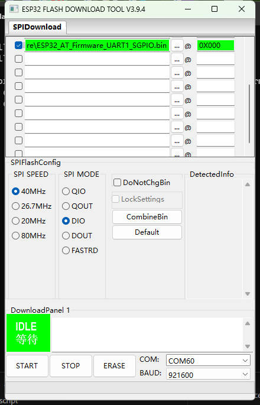

LilyGo Scirpt
===========================

- The example is based on [MaixPy_scripts](https://github.com/sipeed/MaixPy_scripts)
- Getting started document  [MaixPy Docs](https://cn.maixpy.sipeed.com/maixpy/en/)
- [TWatch & M1 source code ](https://github.com/Xinyuan-LilyGO/MaixPy)
- [ESP32 Firmware source code](https://github.com/adafruit/nina-fw)
- [MaixPy IDE](http://dl.sipeed.com/MAIX/MaixPy/ide/)
- [kflash_gui](https://dl.sipeed.com/shareURL/MAIX/tools)

## Use reference

- [T-BAO](https://www.youtube.com/watch?v=vCzTFDb4YZ0)
    You can refer to this video to use
    
## About ESP32 Firmware:
- Twatch AT firmware please select `ESP32_AT_Firmware_UART1.bin`
- M1 AT firmware, please select `ESP32_AT_Firmware_UART0.bin`
- Twatch & M1 SPI firmware, please select `ESP32_SPI_Firmware_1.7.1.bin`

1. Tool download  [flash_download_tool](https://www.espressif.com/sites/default/files/tools/flash_download_tool_v3.8.5.zip)

2. Set according to the picture , Both AT firmware and SPI firmware programming address are set to 0 
    
    

## Attention
1. Ensure that the disk format of the sd card is `FAT32` and the disk partition table type is `MBR` and that the sd card supports the `spi` protocol

2. You need to use a rechargeable 9V lithium battery. The recommended battery brand is `Doublepow` battery model 9V- Li-ion-650mAh, or other brands of 9V batteries that meet the discharge current of 600mA. 

3. When removing the 9V battery compartment, you need to pry the battery open from the front cable outlet position with a screwdriver or other slender tools, and then pull out the battery compartment from the back.