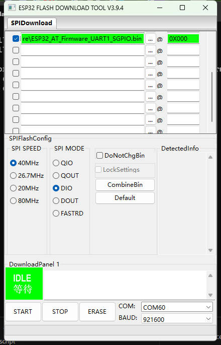

LilyGo Scirpt
===========================

- 以[MaixPy_scripts](https://github.com/sipeed/MaixPy_scripts)为例。
- 入门文档 [MaixPy Docs](https://cn.maixpy.sipeed.com/maixpy/en/)
- [手表& M1源代码](https://github.com/Xinyuan-LilyGO/MaixPy)
- [ESP32固件源代码](https://github.com/adafruit/nina-fw)
- [MaixPy IDE](http://dl.sipeed.com/MAIX/MaixPy/ide/)

关于ESP32固件：
- 查看AT固件请选择`ESP32_AT_Firmware_UART1.bin`
- M1 AT固件，请选择`ESP32_AT_Firmware_UART0.bin`
- 手表和M1 SPI固件，请选择`ESP32_SPI_Firmware_1.7.1.bin`

1. 工具下载 [flash_download_tool](https://www.espressif.com/sites/default/files/tools/flash_download_tool_v3.8.5.zip)

2. 按图设置，AT固件和SPI固件编程地址都设置为0
    

# #注意
1. 确保sd卡的磁盘格式为“FAT32”，磁盘分区表类型为“MBR”，支持“spi”协议

2. 你需要使用可充电的9V锂电池。推荐使用`倍量`9V- 650毫安锂离子电池，或其他品牌的放电电流达到600mA的9V电池。

3. 拆卸9V电池盒时，需先用螺丝刀或其他细长工具将电池从前端出线位置撬开，再从后部拔出电池盒。